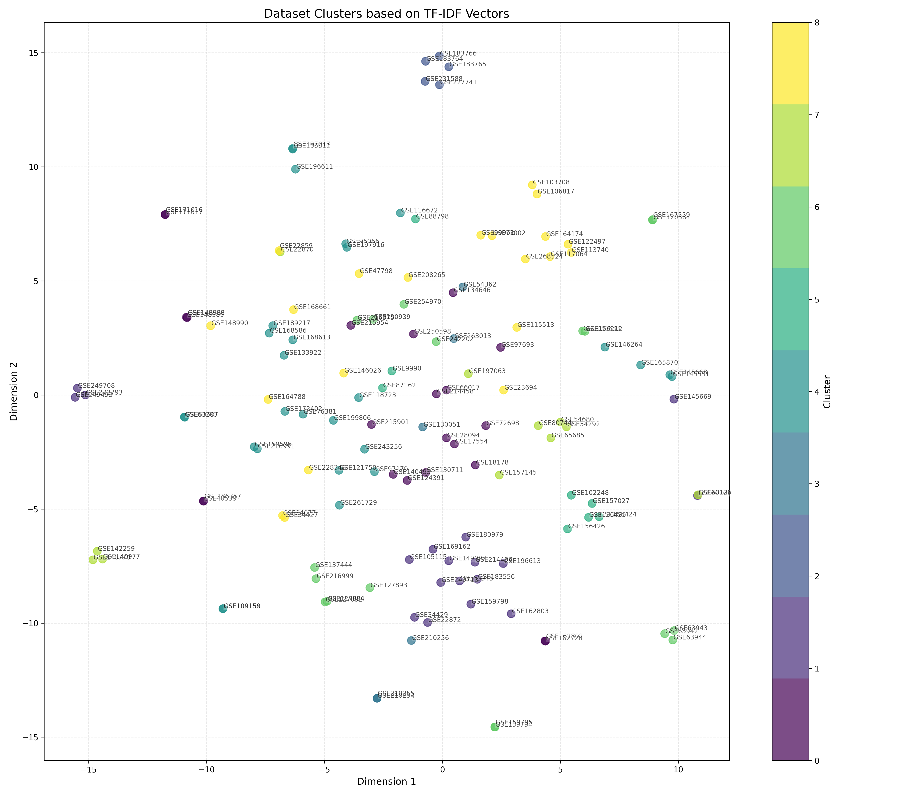
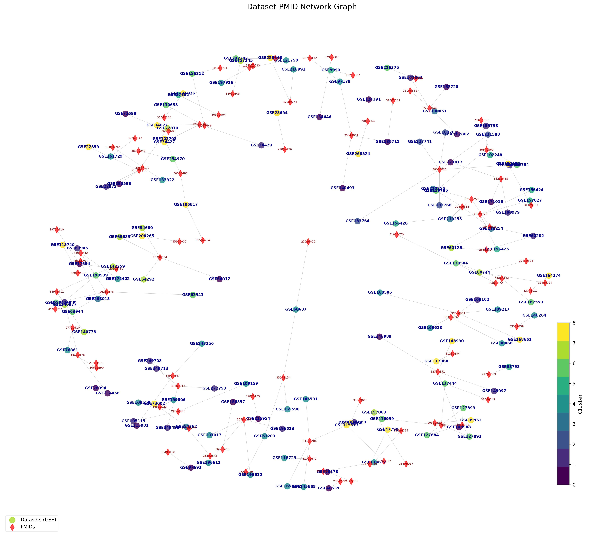
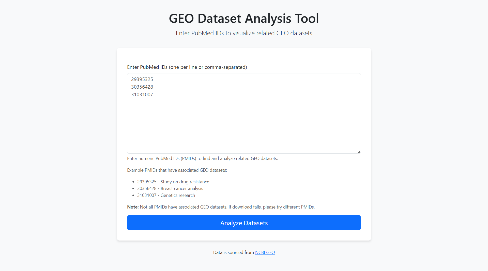
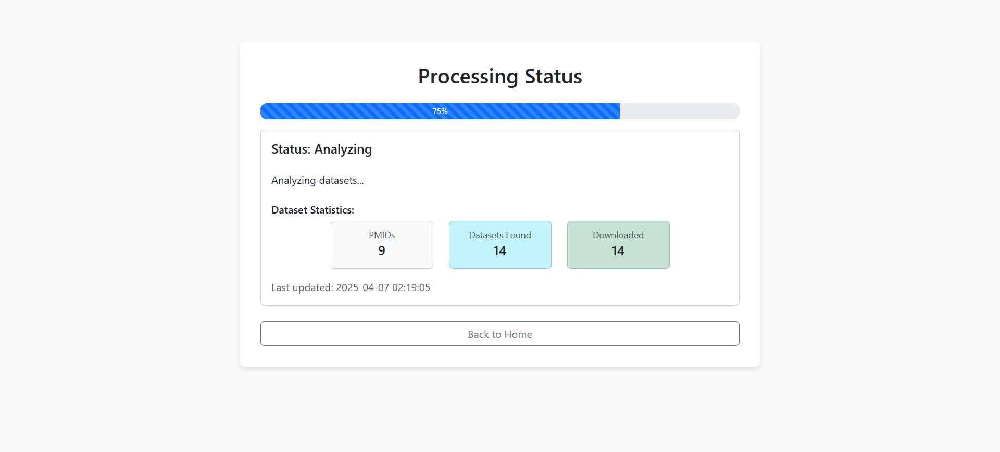
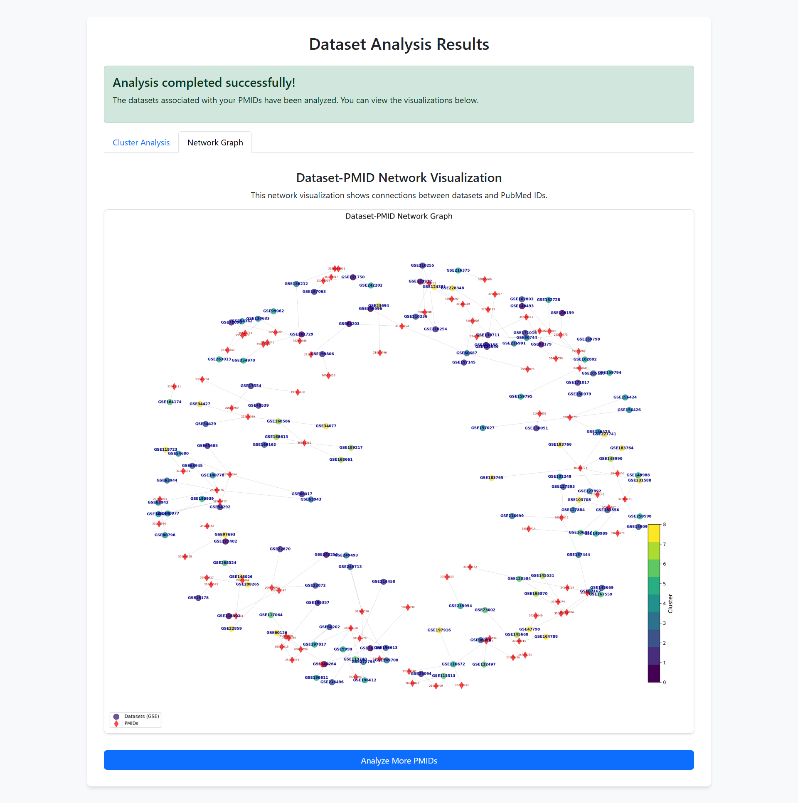

# GEO Dataset Analysis Tool

A web application for retrieving, processing, and visualizing datasets from the Gene Expression Omnibus (GEO) repository based on PubMed IDs.

## Overview

This application allows users to:

1. Enter PubMed IDs and retrieve associated GEO datasets
2. Process the datasets to extract relevant information
3. Analyze and visualize the datasets using techniques like TF-IDF, clustering, and network graphs

## Features

-   Web-based interface for entering PubMed IDs
-   Real-time progress monitoring during data retrieval and processing
-   Automatic dataset clustering based on text similarity
-   Interactive visualizations including cluster plots and network graphs
-   Support for both single PubMed IDs and batch processing

## Example Visualizations

### Cluster Analysis

Clusters show how datasets are related based on their content:



### Network Graph

Network graph shows connections between datasets and PubMed IDs:



## Application Interface

### Home Page

Enter PubMed IDs to start the analysis:



### Progress Tracking

Monitor the download and analysis progress in real-time:



### Results View

View the generated visualizations:



## Installation

### Prerequisites

_prefferably_

-   Python 3.13

### Step 1: Clone the repository

### Step 2: Create a virtual environment (optional but recommended)

```bash
python -m venv venv
```

Activate the virtual environment:

-   Windows:
    ```bash
    venv\Scripts\activate
    ```
-   macOS/Linux:
    ```bash
    source venv/bin/activate
    ```

### Step 3: Install dependencies

```bash
pip install -r requirements.txt
```

## Usage

### Starting the Web Application

Run the following command in the project directory:

```bash
python web_app.py
```

The web application will be available at [http://localhost:5000](http://localhost:5000) in your browser.

### Using the Web Interface

1. **Enter PubMed IDs**:

    - Enter PubMed IDs in the text area (one per line or comma-separated)
    - You can use the example IDs provided for testing

2. **Monitor Progress**:

    - After submitting PMIDs, you'll be redirected to a progress page
    - The progress bar shows the current status
    - Download statistics are displayed in real-time

3. **View Results**:
    - When processing completes, you'll see two types of visualizations:
        - **Cluster Analysis**: Shows how datasets are grouped based on text similarity
        - **Network Graph**: Shows connections between datasets and the PubMed IDs

### Example PubMed IDs

-   29395325
-   30356428
-   31031007

### Command-line Interface

If you prefer using the command line, you can also run the pipeline without the web interface:

```bash
python app.py
```

For this method, you need to create a file named `PMIDs_list.txt` in the root directory with one PMID per line.

## Project Structure

-   `web_app.py`: Flask web application
-   `app.py`: Command-line interface
-   `getdata.py`: Functions for downloading datasets from GEO
-   `processdata.py`: Dataset processing and extraction
-   `analysis.py`: TF-IDF analysis and clustering
-   `visualize.py`: Data visualization functions
-   `templates/`: HTML templates for the web interface
-   `static/`: Static files and generated visualizations
-   `analysis/`: Plots for clustering and network graphs, and csv's of **clustering results, similarity of documents matrix, tf-idf features and tf-idf value matrix.**
-   `datasets/`: Downloaded datasets from GEO Database. They are downloaded in `.gz` format, and then extracted to `SOFT` format for processing.
-   `output\`: csv file of required text fields, and corresponding `pubmed_ids`

## Troubleshooting

### Common Issues

1. **No datasets downloaded**:

    - Not all PubMed IDs have associated GEO datasets
    - Try the example PMIDs provided in the web interface
    - Check network connectivity to NCBI servers

2. **Processing errors**:

    - Ensure your Python environment has all dependencies installed
    - Check the console output for detailed error messages

3. **Visualization issues**:
    - Some visualizations may take longer for large numbers of datasets

## License

This project is available under the MIT License - see the LICENSE file for details.
